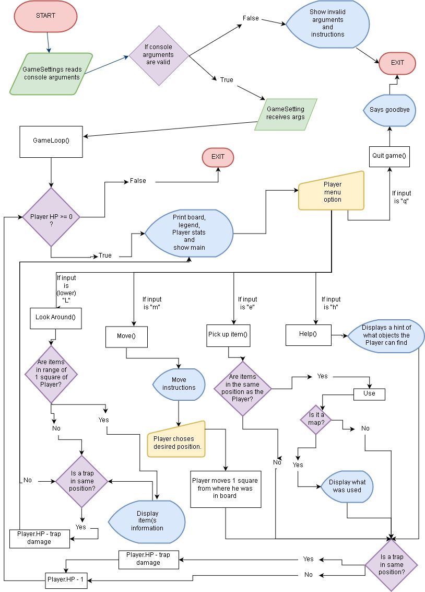

## Título do Projeto:
LastResort_RougueLite (Projeto de 2ª. Época)

### Autores:

*[João Rebelo - a21805230](https://github.com/JBernardoRebelo)*  
*[Miguel Fernández - a21803644](https://github.com/MizuRyujin)*

### Repositório Git:

*[LastResource_Roguelike](https://github.com/JBernardoRebelo/LastResource_Roguelike)*

### Quem fez o quê:

João Rebelo - Classe: `Player`; `Trap`; `TrapType`; `Checker` ( `TrapPlayer(), ComponentPosChecker(), MenuChecker() ); PlayerActions ( Move(), LookAround(), PickUpItem(), FogOfWar()` ); `GameManager` ( `StartGame(), Loop(), NewLevel(), TrapGen(), TrapWorker(), RndBtw(), AddComponents()` ); `MapComponents`; `MapItem`; `Exit` e `Render`.

Miguel Fernández - Classe: `GameSettings`; `Render`; `GameManager`. Documentação XML, fluxograma e UML. Mensagens de erro. Loops que evitam a introdução de "inputs" inválidos. Lógica.

## Descrição da Solução:

### Arquitetura da Solução

Foram pensados vários algoritmos como solução para os problemas.
Para as fases implementadas, desenhar o mapa foi utilizado um modelo parecido ao projeto anterior, onde é alterada a posição do cursor de texto na consola e é impresso os caracteres designados dos componentes do jogo (o mapa em sí, o jogador e, nas fases seguintes, objetos de jogo, como armadilhas). Para métodos que fossem relacionados com a vizinhança de Moore do jogador, realizamos cálculos para verificar quais a posições na sua vizinhança (que ficariam descobertas, para o `FogOfWar()`) e o que continham (como no caso do `LookAround()`). Para os factores aleatórios (_Spawn_ dos objetos, dano das armadilhas) foi utilizado apenas um método da classe `System.Random`, `Random.Next(int32, int32)`, apropriado para o método `RandBtw(int 32, int32)` para facilitar a sua utilização.
Foi utilizada uma lista para guardar a informação dos componentes do mundo.

### Diagrama UML

### Fluxograma

## Conclusões

Consolidamos conhecimento em relação à criação de documentação. Compreendemos que devemos esforçar-mo-nos para encontrar soluções simples e ser menos ambiciosos na criação de algoritmos. Compreendemos melhor o polimorfismos dos objetos e como realizar interações com isso em vista. Sentimos que a falta de prática que tivemos ao longo do semestre (por nossa culpa), nos abrandou no desenvolvimento deste projeto e de outros, e que devemos trabalhar mais nesse sentido.

## Referências

Para referências utilizámos a
 *[.NET API](https://docs.microsoft.com/en-us/dotnet/api/?view=netcore-2.2)* 
 para tirar dúvidas mais específicas, abaixo referidos os tópicos pesquisados.

- *[List Class](https://docs.microsoft.com/en-us/dotnet/api/system.collections.generic.list-1?view=netcore-2.2)*
- *[Is](https://docs.microsoft.com/en-us/dotnet/csharp/language-reference/keywords/is)*
- *[IEnumerable Interface](https://docs.microsoft.com/en-us/dotnet/api/system.collections.ienumerable?view=netframework-4.8)*
- *[Colors Class](https://docs.microsoft.com/en-us/dotnet/api/system.windows.media.colors?view=netframework-4.8)*
- *[Random.Next Method](https://docs.microsoft.com/en-us/dotnet/api/system.random.next?view=netframework-4.8)*

Para além das referências anteriores,
 também tirámos algumas dúvidas com o professor Nuno Fachada.
