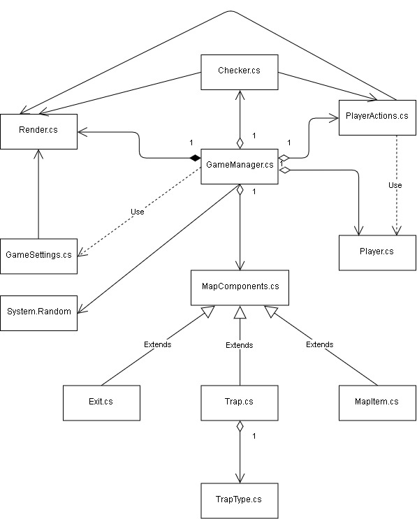

## Título do Projeto:
LastResort_RougueLite (Projeto de 2ª. Época)

### Autores:

*[João Rebelo - a21805230](https://github.com/JBernardoRebelo)*  
*[Miguel Fernández - a21803644](https://github.com/MizuRyujin)*

### Repositório Git:

*[LastResource_Roguelike](https://github.com/JBernardoRebelo/LastResource_Roguelike)*

### Quem fez o quê:
João Rebelo - Classe: `Player`; `Trap`; `TrapType`; `Checker` ( `TrapPlayer(), ComponentPosChecker(), MenuChecker() ); PlayerActions ( Move(), LookAround(), PickUpItem(), FogOfWar()` ); `GameManager` ( `StartGame(), Loop(), NewLevel(), TrapGen(), TrapWorker(), RndBtw(), AddComponents()` ); `MapComponents`; `MapItem`; `Exit` e `Render`.

Miguel Fernández - Classe: `GameSettings`; `Render`; `GameManager`. Documentação XML, fluxograma e UML. Mensagens de erro. Loops que evitam a introdução de "inputs" inválidos.

## Descrição da Solução:

### Arquitetura da Solução

### Diagrama UML

### Fluxograma

## Conclusões

## Referências

Para referências utilizámos a
 *[.NET API](https://docs.microsoft.com/en-us/dotnet/api/?view=netcore-2.2)* 
 para tirar dúvidas mais específicas, abaixo referidos os tópicos pesquisados.

- *[List Class](https://docs.microsoft.com/en-us/dotnet/api/system.collections.generic.list-1?view=netcore-2.2)*
- *[Is](https://docs.microsoft.com/en-us/dotnet/csharp/language-reference/keywords/is)*
- *[IEnumerable Interface](https://docs.microsoft.com/en-us/dotnet/api/system.collections.ienumerable?view=netframework-4.8)*
- *[Colors Class](https://docs.microsoft.com/en-us/dotnet/api/system.windows.media.colors?view=netframework-4.8)*
- *[Random.Next Method](https://docs.microsoft.com/en-us/dotnet/api/system.random.next?view=netframework-4.8)*

Para além das referências anteriores,
 também tirámos algumas dúvidas com o professor Nuno Fachada.
